# Database Architecture

Vela CMS database schema with multi-tenancy, content management, event sourcing, and Better Auth integration.

## ER Diagram

```mermaid
erDiagram
    %% ===== MULTI-TENANCY =====
    organizations |o--o{ harbors : "optionally groups"
    organizations ||--o{ organization_members : "has members"

    harbors ||--o{ harbor_roles : "has roles"
    harbors ||--o{ harbor_members : "has members"
    harbors ||--o{ harbor_locales : "has locales"
    harbors ||--o{ blueprints : "has blueprints"
    harbors ||--o{ content : "has content"
    harbors ||--o{ workflows : "has workflows"
    harbors ||--o{ assets : "has assets"
    harbors ||--o{ asset_folders : "has folders"
    harbors ||--o{ api_keys : "has api keys"
    harbors ||--o{ harbor_plugins : "has plugins"

    %% ===== ROLES =====
    harbor_roles ||--o{ harbor_members : "assigned to"

    %% ===== CONTENT SYSTEM =====
    blueprints ||--o{ content : "defines"
    content ||--o{ content_refs : "references"
    content ||--o{ content_feedback : "has feedback"

    %% ===== ASSETS =====
    asset_folders ||--o{ assets : "contains"
    asset_folders ||--o{ asset_folders : "nested in"

    %% ===== PLUGINS =====
    plugins ||--o{ harbor_plugins : "installed in"

    %% ===== AUTH (Better Auth) =====
    user ||--o{ session : "has sessions"
    user ||--o{ account : "has accounts"
    user ||--o{ harbor_members : "member of harbors"
    user ||--o{ organization_members : "member of orgs"

    %% ===== EVENT SOURCING =====
    harbors ||--o{ events : "harbor-scoped events"
    organizations ||--o{ events : "org-scoped events"
    harbors ||--o{ snapshots : "harbor snapshots"
    harbors ||--o{ sync_cursors : "tracks sync"

    %% ===== TABLE DEFINITIONS =====
    organizations {
        text id PK
        text name
        text slug UK
        json settings
        datetime created_at
        datetime updated_at
    }

    harbors {
        text id PK
        text name
        text slug UK
        text organization_id FK
        json settings
        datetime created_at
        datetime updated_at
    }

    harbor_roles {
        text id PK
        text harbor_id FK
        text name
        text slug
        text description
        json permissions
        boolean is_system
        datetime created_at
        datetime updated_at
    }

    harbor_members {
        text id PK
        text user_id FK
        text harbor_id FK
        text role_id FK
        boolean is_owner "harbor ownership flag"
        json permissions "per-user overrides"
        datetime created_at
        datetime updated_at
    }

    organization_members {
        text id PK
        text user_id FK
        text organization_id FK
        boolean is_owner
        datetime created_at
    }

    harbor_locales {
        text id PK
        text harbor_id FK
        text code
        text name
        boolean is_default
        text fallback_locale
        datetime created_at
    }

    blueprints {
        text id PK
        text harbor_id FK
        text name
        text slug
        text description
        text icon
        text type "fragment or entity"
        json schema
        json settings
        integer version
        datetime created_at
        datetime updated_at
    }

    content {
        text id PK
        text harbor_id FK
        text blueprint_id FK
        text canonical_id "groups translations"
        text locale FK
        text slug
        text title
        json data
        text workflow_state "nullable, set if blueprint has workflowId"
        boolean is_published "visibility to end users"
        integer version
        datetime published_at
        text created_by FK
        text updated_by FK
        datetime created_at
        datetime updated_at
    }

    content_refs {
        text id PK
        text source_id FK
        text target_canonical_id
        text field_path
        integer position
        datetime created_at
    }

    content_feedback {
        text id PK
        text content_id FK
        text field_path
        text user_id FK
        text message
        boolean resolved
        text resolved_by FK
        datetime resolved_at
        datetime created_at
        datetime updated_at
    }

    workflows {
        text id PK
        text harbor_id FK
        text name
        text description
        json states
        json transitions
        text initial_state
        boolean is_default
        datetime created_at
        datetime updated_at
    }

    assets {
        text id PK
        text harbor_id FK
        text filename
        text original_filename
        text mime_type
        integer size
        text storage_key
        json metadata
        text folder_id FK
        text created_by FK
        datetime created_at
        datetime updated_at
    }

    asset_folders {
        text id PK
        text harbor_id FK
        text name
        text parent_id FK
        datetime created_at
    }

    plugins {
        text id PK
        text name UK
        text version
        text description
        boolean enabled
        json settings
        datetime created_at
        datetime updated_at
    }

    harbor_plugins {
        text id PK
        text harbor_id FK
        text plugin_id FK
        boolean enabled
        json settings
        datetime created_at
    }

    api_keys {
        text id PK
        text harbor_id FK
        text name
        text key_hash UK
        json permissions
        datetime last_used_at
        datetime expires_at
        text created_by FK
        datetime created_at
    }

    events {
        integer sequence PK "auto-increment for sync"
        text id UK
        text harbor_id FK
        text aggregate_type
        text aggregate_id
        text event_type
        integer version "per-aggregate for concurrency"
        json payload
        json metadata
        datetime created_at
    }

    snapshots {
        text aggregate_type PK
        text aggregate_id PK
        integer version
        json state
        datetime created_at
    }

    sync_cursors {
        text id PK
        text harbor_id FK
        text client_id
        integer last_sequence
        datetime last_synced_at
    }

    user {
        text id PK
        text name
        text email UK
        boolean emailVerified
        text image
        datetime createdAt
        datetime updatedAt
    }

    session {
        text id PK
        text userId FK
        text token UK
        datetime expiresAt
        text ipAddress
        text userAgent
        datetime createdAt
        datetime updatedAt
    }

    account {
        text id PK
        text user_id FK
        text accountId
        text providerId
        text accessToken
        text refreshToken
        datetime accessTokenExpiresAt
        datetime refreshTokenExpiresAt
        text scope
        text idToken
        text password
        datetime createdAt
        datetime updatedAt
    }

    verification {
        text id PK
        text identifier
        text value
        datetime expiresAt
        datetime createdAt
        datetime updatedAt
    }
```



## Table Overview

### Multi-Tenancy

| Table                | Description                                                |
| -------------------- | ---------------------------------------------------------- |
| organizations        | Optional grouping of harbors (enterprise feature)          |
| harbors              | Main tenant unit - each harbor is an isolated CMS instance |
| harbor_roles         | Custom roles defined per harbor                            |
| harbor_members       | User membership and role assignment within a harbor        |
| organization_members | User membership within an organization (owner or member)   |
| harbor_locales       | Locale/language configuration per harbor                   |

### Content System

| Table            | Description                                                              |
| ---------------- | ------------------------------------------------------------------------ |
| blueprints       | Schema definitions for fragments and entities (configurable per harbor)  |
| content          | Read model projected from events. Stores current state for fast queries. |
| content_refs     | Entity references between content. Projected from events.                |
| content_feedback | Comments/feedback on content fields                                      |
| workflows        | Workflow state machine definitions                                       |

### Content Model Concepts

| Concept   | Description                                                                                      |
| --------- | ------------------------------------------------------------------------------------------------ |
| Blueprint | Defines the structure/schema for content. Type is `fragment` (owned) or `entity` (standalone)    |
| Fragment  | A content piece owned by its parent (e.g., Hero on Homepage). Deleted when parent is deleted.    |
| Entity    | Standalone content that exists independently (e.g., Author, Product). Referenced by many.        |
| Reference | A link from one content to another via `content_refs`, enabling composition without deep nesting |

### Assets

| Table         | Description                              |
| ------------- | ---------------------------------------- |
| assets        | Uploaded files (images, documents, etc.) |
| asset_folders | Hierarchical folder structure for assets |

### Plugins

| Table          | Description                              |
| -------------- | ---------------------------------------- |
| plugins        | Available plugins in the system          |
| harbor_plugins | Plugins enabled per harbor with settings |

### Event Sourcing

| Table        | Description                                                                  |
| ------------ | ---------------------------------------------------------------------------- |
| events       | Append-only event log with `sequence` for sync and `version` for concurrency |
| snapshots    | Cached aggregate state to avoid replaying thousands of events                |
| sync_cursors | Tracks `last_sequence` per client for real-time sync                         |

### Authentication (Better Auth)

| Table        | Description                                  |
| ------------ | -------------------------------------------- |
| user         | User accounts (managed by Better Auth)       |
| session      | Active sessions with tokens                  |
| account      | OAuth provider accounts and email/password   |
| verification | Email verification and password reset tokens |

### API Access

| Table    | Description                      |
| -------- | -------------------------------- |
| api_keys | API keys for programmatic access |

## Roles & Permissions

### How Roles Work

Roles are **custom and per-tenant**. Each harbor and organization can define their own roles with specific permissions.

- `harbor_roles` — roles scoped to a single harbor
- `organization_roles` — roles scoped to an organization (applies across harbors)
- `is_system` — marks built-in roles that cannot be deleted

### Default System Roles (created when harbor/org is created)

**Harbor Roles:**

| Role   | Description                                           |
| ------ | ----------------------------------------------------- |
| admin  | Full control over harbor settings, users, and content |
| editor | Can create, edit, and delete content                  |
| viewer | Read-only access to content                           |

**Harbor Ownership:**

Harbors use an `is_owner` flag on `harbor_members` to distinguish ownership from roles:

- **Owner** (`is_owner = true`) — created the harbor. Can delete harbor, transfer ownership, manage billing. Cannot be removed by admins.
- **Member** (`is_owner = false`) — permissions determined by their assigned role.

**Organization Membership:**

Organizations use a simple `is_owner` flag instead of roles:

- **Owner** (`is_owner = true`) — can manage the org, create harbors, invite users
- **Member** (`is_owner = false`) — can access harbors they are assigned to

### Permissions JSON Structure

```json
{
	"content": {
		"create": true,
		"read": true,
		"update": true,
		"delete": false,
		"publish": false
	},
	"assets": {
		"create": true,
		"read": true,
		"update": true,
		"delete": false
	},
	"blueprints": {
		"manage": false
	},
	"users": {
		"manage": false
	},
	"settings": {
		"manage": false
	}
}
```

### Per-User Overrides

The `harbor_users.permissions` field allows granular overrides for specific users:

```json
{
	"blueprints": ["blog-post", "product"],
	"can_publish": true,
	"can_delete": false
}
```

Effective permissions = role permissions merged with user-specific overrides.
