# Database Architecture

Vela CMS database schema with multi-tenancy, content management, event sourcing, and Better Auth integration.

## ER Diagram

```mermaid
erDiagram
    %% ===== MULTI-TENANCY =====
    organizations |o--o{ harbors : "optionally groups"
    organizations ||--o{ organization_users : "has many"

    harbors ||--o{ harbor_users : "has many"
    harbors ||--o{ harbor_locales : "has many"
    harbors ||--o{ content_types : "has many"
    harbors ||--o{ content : "has many"
    harbors ||--o{ workflows : "has many"
    harbors ||--o{ assets : "has many"
    harbors ||--o{ asset_folders : "has many"
    harbors ||--o{ api_keys : "has many"
    harbors ||--o{ harbor_plugins : "has many"

    %% ===== CONTENT SYSTEM =====
    content_types ||--o{ content : "defines"
    content ||--o{ content_versions : "has versions"
    content ||--o{ content_feedback : "has feedback"

    %% ===== ASSETS =====
    asset_folders ||--o{ assets : "contains"
    asset_folders ||--o{ asset_folders : "nested in"

    %% ===== PLUGINS =====
    plugins ||--o{ harbor_plugins : "installed in"

    %% ===== AUTH (Better Auth) =====
    user ||--o{ session : "has sessions"
    user ||--o{ account : "has accounts"
    user ||--o{ harbor_users : "member of"
    user ||--o{ organization_users : "member of"
    user ||--o{ refresh_tokens : "has tokens"

    %% ===== EVENT SOURCING =====
    harbors ||--o{ events : "harbor-scoped events"
    organizations ||--o{ events : "org-scoped events"
    harbors ||--o{ snapshots : "harbor snapshots"
    harbors ||--o{ sync_cursors : "tracks sync"

    %% ===== TABLE DEFINITIONS =====
    organizations {
        text id PK
        text name
        text slug UK
        json settings
        datetime created_at
        datetime updated_at
    }

    harbors {
        text id PK
        text name
        text slug UK
        text organization_id FK
        json settings
        datetime created_at
        datetime updated_at
    }

    harbor_users {
        text id PK
        text user_id FK
        text harbor_id FK
        text role
        json permissions
        datetime created_at
    }

    organization_users {
        text id PK
        text user_id FK
        text organization_id FK
        text role
        datetime created_at
    }

    harbor_locales {
        text id PK
        text harbor_id FK
        text code
        text name
        boolean is_default
        text fallback_locale
        datetime created_at
    }

    content_types {
        text id PK
        text harbor_id FK
        text name
        text slug
        text description
        text icon
        json schema
        json settings
        integer version
        datetime created_at
        datetime updated_at
    }

    content {
        text id PK
        text harbor_id FK
        text content_type_id FK
        text slug
        json data
        text workflow_state
        integer version
        datetime published_at
        text created_by
        text updated_by
        datetime created_at
        datetime updated_at
    }

    content_versions {
        text id PK
        text content_id FK
        integer version
        json data
        text created_by
        datetime created_at
    }

    content_feedback {
        text id PK
        text content_id FK
        text field_path
        text user_id FK
        text message
        boolean resolved
        text resolved_by FK
        datetime resolved_at
        datetime created_at
        datetime updated_at
    }

    workflows {
        text id PK
        text harbor_id FK
        text name
        text description
        json states
        json transitions
        text initial_state
        boolean is_default
        datetime created_at
        datetime updated_at
    }

    assets {
        text id PK
        text harbor_id FK
        text filename
        text original_filename
        text mime_type
        integer size
        text storage_key
        json metadata
        text folder_id FK
        text created_by FK
        datetime created_at
        datetime updated_at
    }

    asset_folders {
        text id PK
        text harbor_id FK
        text name
        text parent_id FK
        datetime created_at
    }

    plugins {
        text id PK
        text name UK
        text version
        text description
        boolean enabled
        json settings
        datetime created_at
        datetime updated_at
    }

    harbor_plugins {
        text id PK
        text harbor_id FK
        text plugin_id FK
        boolean enabled
        json settings
        datetime created_at
    }

    api_keys {
        text id PK
        text harbor_id FK
        text name
        text key_hash UK
        json permissions
        datetime last_used_at
        datetime expires_at
        text created_by FK
        datetime created_at
    }

    refresh_tokens {
        text id PK
        text user_id FK
        text harbor_id FK
        text token_hash UK
        datetime expires_at
        datetime created_at
    }

    events {
        text id PK
        text aggregate_type
        text aggregate_id
        text event_type
        json payload
        json metadata
        datetime created_at
    }

    snapshots {
        text id PK
        text aggregate_type
        text aggregate_id
        integer version
        json state
        datetime created_at
    }

    sync_cursors {
        text id PK
        text harbor_id FK
        text client_id
        text last_event_id
        datetime last_sync_at
    }

    user {
        text id PK
        text name
        text email UK
        text image
        text role
        datetime created_at
        datetime updated_at
    }

    session {
        text id PK
        text user_id FK
        text token
        datetime expires_at
        text ip_address
        text user_agent
    }

    account {
        text id PK
        text user_id FK
        text provider
        text provider_account_id
        text access_token
        text refresh_token
    }
```

## Table Overview

### Multi-Tenancy
| Table | Description |
|-------|-------------|
| organizations | Optional grouping of harbors (enterprise feature) |
| harbors | Main tenant unit - each harbor is an isolated CMS instance |
| harbor_users | User membership and roles within a harbor |
| organization_users | User membership within an organization |
| harbor_locales | Locale/language configuration per harbor |

### Content System
| Table | Description |
|-------|-------------|
| content_types | Schema definitions for content (like Blog Post, Product) |
| content | Actual content entries |
| content_versions | Version history for content |
| content_feedback | Comments/feedback on content fields |
| workflows | Workflow state machine definitions |

### Assets
| Table | Description |
|-------|-------------|
| assets | Uploaded files (images, documents, etc.) |
| asset_folders | Hierarchical folder structure for assets |

### Plugins
| Table | Description |
|-------|-------------|
| plugins | Available plugins in the system |
| harbor_plugins | Plugins enabled per harbor with settings |

### Event Sourcing
| Table | Description |
|-------|-------------|
| events | Event log for all changes |
| snapshots | Aggregate state snapshots |
| sync_cursors | Client sync position tracking |

### Authentication (Better Auth)
| Table | Description |
|-------|-------------|
| user | User accounts |
| session | Active sessions |
| account | OAuth provider accounts |
| refresh_tokens | Token refresh tracking |

### API Access
| Table | Description |
|-------|-------------|
| api_keys | API keys for programmatic access |
